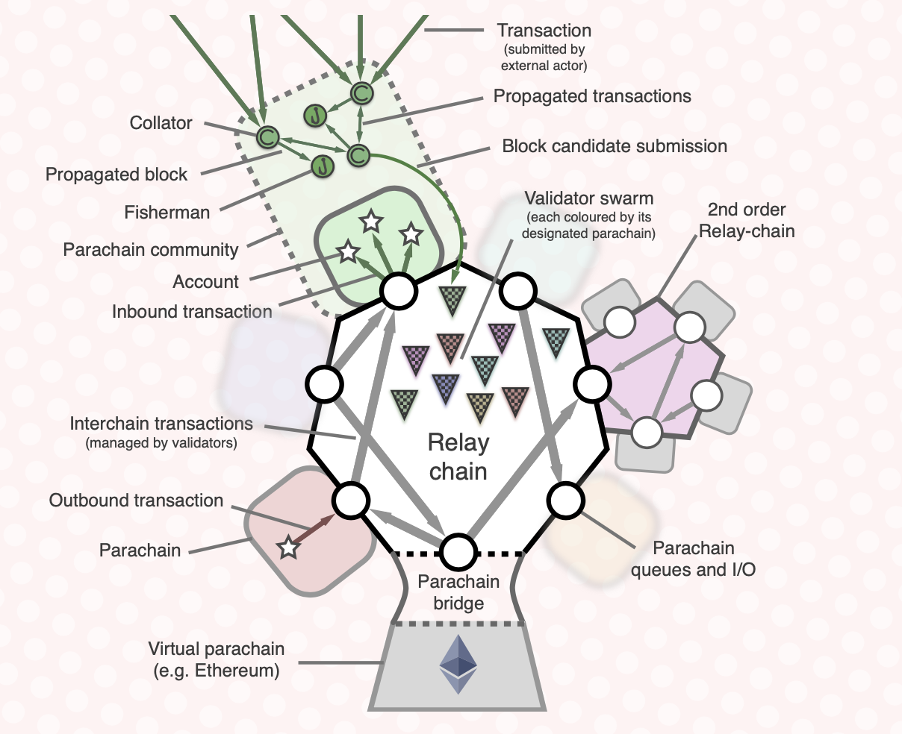

# White Paper

## メモ

- Polkadot が解決する問題
  - スケーラビリティ
    - 1 つのトランザクションを処理するために、システムが処理、帯域、ストレージにどれだけのリソースをグローバルに費やしているか
    - 典型的な条件下でどれだけの数のトランザクションを合理的に処理できるか
  - 分離性
    - 複数の関係者やアプリケーションの分割ニーズに、同一のフレームワークでほぼ最適に対応できるか。
- Ethreum
  - 1 秒間に 30 トランザクション程度が限界
  - PoS でも同じ
- スケーラビリティ問題の解決策
  - コンセンサスアーキテクチャと状態遷移メカニズムを切り離す
- これまでのブロックチェーン実装
  - 一般的なアプリケーションに対して、地理的に優れた単一のチェーンを提供することに重点が置かれていた
  - Polkadot 自体は、固有のアプリケーション機能を一切提供しないように設計
- Polkadot committee
  - ユーザーの開発ニーズと開発者の正当性ニーズを反映させるため 2 つの委員会
    - 「ユーザー」委員会（ボンド validator ーで構成）
    - 「技術」委員会（主要なクライアント開発者とエコシステムプレーヤーで構成）
- Polkadot の基本理念、デザイン決定を評価ルール
  - 最小限
    - Polkadot はできるだけ機能的でないものでなければならない。
  - シンプル
    - 基本プロトコルには、ミドルウェアにオフロードできる範囲を超えた複雑さがあってはなりません。
      - ミドルウェアにオフロードしたり、パラチェーンを介して配置したり、後の最適化で導入したりすることが合理的である以上の複雑さが基本プロトコルに存在してはならない。
    - 一般：パラチェーンに不必要な要求、制約、制限を設けるべきではない
      - Polkadot は合意形成のためのテストベッドであり、拡張機能が適合するモデルを可能な限り縮小することで最適化することができる。
    - ポルカドットはコンセンサスシステム開発のテストベッドであるべきである。
      - テストベッド: 新技術の実証試験に使用されるプラットフォーム
    - 堅牢であること
      - 基本的に安定したベースレイヤーを提供すること。
      - 経済的に安定していることに加えて、高額な報酬を得ることができる攻撃の手段を最小限に抑えるために分散化することも意味している
- Polkadot の哲学
  - 役割は 4 つ
    - collator
      - validator が有効なパラチェーンブロックを生成するのを支援する
      - 既存の PoW ブロックチェーンでマイナーが行うのと同じように、新しいブロックを作成したり、トランザクションを実行したりするために必要な情報をすべて保持
      - 取引を照合・実行して封印されていないブロックを作成し、そのブロックをゼロ知識証明とともに、パラチェーンブロックの提案を担当する validator に提供する
    - fisherman
      - 少なくとも 1 つの被結合者が違法行為を行ったことをタイムリーに証明することで報酬を得る
      - 悪さをしている validator を発見することで高額の報酬を得ることができる
    - nominator
      - リスクキャピタルを預ける以外に追加の役割はない
      - 特定の validator(またはその集合)がネットワークの保守に責任を持って行動することを信頼していることを示す
    - validator
      - 最高額の課金者
      - Polkadot ネットワーク上の新しいブロックを封印する手助けをする
      - ステーキングをした他の nominator が 1 人または複数の validator を指名して代理を務めることができる
      - そのため validator のステーキングボンドの一部は必ずしも validator 自身が所有するのではなく、これらの指名者が所有することになる
      - validator が全てのパラチェーンの完全に同期したデータベースを維持することは 合理的に期待できない
      - 案された新しいパラチェーンブロックを作成するタスクを collator に依頼する
- デザイン
  - 
  - modern asynchronous Byzantine fault-tolerant (BFT) algorithm
  - PoS で validator を決定する
  - validator は Nominated Proof-of-Stake (NPoS)方式で、不定期に(多くても 1 日 1 回、少なくても四半期に 1 回)選出される
  - 報酬は、トークンベースの拡大による資金の比例配分（年間最大 100％だが、10％程度の可能性もある）と、徴収した取引手数料によって得ることができる
  - Parachain で実行されたトランザクションは、第 2 の Parachain、あるいは潜在的にはリレーチェーンへのトランザクションのディスパッチを行うことができる
  - チェーン間トランザクションは、標準的な外部署名付きトランザクションと事実上区別できない
  - インターチェーン取引には、何らかの手数料の「支払い」が伴うことはない
- Polkadot と Ethereum
  - Ethereum の完全性を考慮すると、Polkadot と Ethereum は、少なくとも簡単に推論できる安全性の範囲内で、お互いに相互運用できる十分な機会がある
  - Polkadot からのトランザクションは validator によって署名され、Ethereum に送り込まれて、トランザクション転送コントラクトによって解釈され、実行されることを想定している
  - Ethreum からのトランザクションはイベントを利用することで、特定のメッセージが転送されるべきかどうかを迅速に確認することができるようになる
    - break-out contract と呼ばれるコントラクトを実行する
    - このコントラクトはイベントを発行する
    - トランザクションの正当性は取り込まれたブロックの深さが 120 に到達することで保つ
- Polkadot と Bitcoin
  - Ethreum と同じような形で実現
  - しかし、合理的で安全なビットコインの相互運用性を持つ仮想パラチェーンを置くことは非現実的ではない
- プロトコルの詳細
  - コンセンサス・メカニズム
  - パラチェーン・インターフェース
  - チェーン間トランザクション・ルーティング
  - リレーチェーン
    - アドレスとアカウント、残高と（リプレイ防止のための）取引カウンターをマッピングするステートベースのチェーン
    - リストアップされたコンストラクトには、自動実行やネットワークメッセージ出力機能がある
    - EVM の場合はコンセンサスコントラクト、バリデーターコントラクト、パラチェーンコントラクトなど、プラットフォーム固有の義務を管理するためのコントラクト（Ethereum のアドレス 1 ～ 4 と同様のもの）が組み込まれる
    - EVM でなければ Wasm
    - リレーチェーンには複数の機能があり、モノリスに実装可能だが、モジュール性を高めるために、これらを「コントラクト」と呼ぶことにしている
      - Ethreum のコントラクトとは違う
- リレーチェーンのコントラクト(モジュール)
  - Staking Contract
    - 下記を管理
      - 現在どのアカウントが validator であるか
      - すぐに validator になることができるか
      - どのアカウントが validator への指名したか
      - ステーキング量、許容可能な支払い率とアドレス、短期（セッション）ID を含むそれぞれのプロパティ
  - Parachain Registry
    - DB のようなストレージ
    - 静的情報と動的情報がある
    - パラチェーンの情報等を保持する
    - 詳細を理解していないので 6.3 をチェック
  - Sealing Relay Blocks
    - Sealing とは PoW ではマイニング
    - Sealing は Polkadot では特定のリレーチェーンブロックとそれが表すパラチェーンブロックの有効性、可用性、正準性に関する validator からの署名付きステートメントの収集
    - Sealing プロセスは、リレーチェーンのブロックと、リレーのコンテンツの一部を構成するパラチェーンのブロックの両方に対応する単一のコンセンサス生成メカニズムの下で行われる
    - パラチェーンは、サブグループによって個別に「コミット」され、後で照合されることはない
    - これにより、リレーチェーンの処理はより複雑になるが、システム全体のコンセンサスを 1 段階で完了させることができ、遅延を最小限に抑え、以降のルーティング処理に役立つ非常に複雑なデータ利用の要件を満たすことができる
    - アルゴリズムは確認
    - 各参加者(validator)は、各パラチェーンブロック候補とリレーチェーンブロック候補に関する、他の参加者からの署名付きステートメント(投票)という形で一連の情報を持っている。
      - 利用可能性: このバリデータは、次のブロックでパラチェーン候補を適切に検証できるように、このブロックからの egress のトランザクション-ポスト情報を持っているかどうか?
        - validator は 1(既知)または 0(未確認)のいずれかに投票できる
        - いったん 1 に投票すると、このプロセスの残りの期間、同じように投票することが約束される
        - これに従わない後の投票は罰則の対象
      - 妥当性 :パラチェーンブロックは有効であり、外部から参照されるデータ(トランザクション等)はすべて利用可能であるか?
        - これは、投票対象のパラチェーンに署名したバリデータにのみ関係する
        - validator は 1(有効)、-1(無効)、0(未確認)のいずれかを投票できる
        - いったん 0 以外に投票すると、プロセスの残りの期間はこの方法で投票することを約束することになる
        - これに従わない後の投票は処罰の対象
    - 投票ルール
      - 少なくとも 3 分の 2 の有効者が賛成票を投じ、反対票を投じていないこと
      - 3 分の 1 以上のバリデータが、出庫待ち情報の利用可能性に賛成票を投じること
    - 投票結果の集計後、リレーチェーンブロックを封印し、次のブロックを封印するプロセスを開始することができる
  - Sealing 方法の改善
    - チェーンを増やすと検証者が増えるため、進行中のネットワーク資源の消費量（特に帯域幅）はチェーンの二乗に比例して増加し、長期的には耐えられない性質となる
    - latency を導入する
      - 33%+1 の vadalitor が、即時ではなく最終的にのみ使用可能かどうかを投票することを義務付ける
      - latency = participants × chains
      - latency = size(system)^2
      - システムが成長すると、ネットワーク全体で必要となる帯域幅と、可用性が確認できるまでの待ち時間が、2 乗で増加することになる
      - 「フラットではない」パラダイムへの移行を余儀なくされる可能性があります
- Collator
  - 任意のパラチェーンのブロックを作成する collator が健全に選択されている必要がある
  - 1 人の collator がパラチェーンを支配すると、外部データが利用できない可能性が低くなるため、いくつかの攻撃が実行可能になってしまう
  - そのため、パラチェーンのブロックに擬似的にランダムな重み付けを行う
  - sybil attack を防ぐため資金量で重み付けを行う
- Overweight Block
  - 自分の管理下の validator だけが簡単に validate しやすいブロック(計算に非常に時間がかかる結果を既に持たせておく)を作成して提案することで有利にする方法
  - ブロックを無効にするときとほぼ同じ対応を行う
- Collator Insurance
  - 悪意のある collator を止める方法 2 つ
    - 資金を多く持っているアカウントのブロックのみ
    - validator は悪意のある collator の資金を没収できる
    - collator は没収に対して他のランダムな validator を陪審員にすることができる
    - その際に保証金を預け入れる
    - 訴えを認めた場合、保証金は返却され、validator は罰金を受ける
    - 訴えを退けた場合、保証金は陪審員にとられる
- Interchain Transaction Routing
  - 特定のパラチェーンから特定のパラチェーンへトランザクションが送達するロジック
  - ステップ(ハイパールーティングという)
    1. collator: validator にコンタクト
    2. collator: それぞれの subgroup がすくなくともひとりの validator と接触したことを確認
    3. collator: それぞれの subgroup が egress キューが利用可能か確認する
    4. collator: ブロック候補を構成
    5. collator: validator に証明情報の送信
    6. collator: 外部取引データ ext を他の collator や validator が利用できるようにする
    7. collator: next block validator subgroup member へ egress キュー情報の送信
    8. validator: 同一セットのメンバーをすべて事前に接続
    9. validator: このブロックのすべてのデータを照合
    10. validator: この証明の候補を受け入れ、有効性の投票を行う
    11. validator: 次のブロックの候補となる egress キューデータを受け入れ、可用性に投票を行う
    12. until consensus
  - 読み飛ばしもあるので再読
- Parachain Validation
